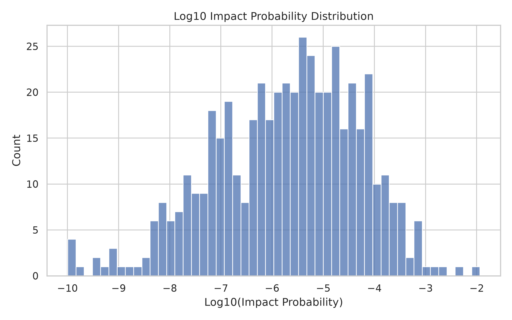
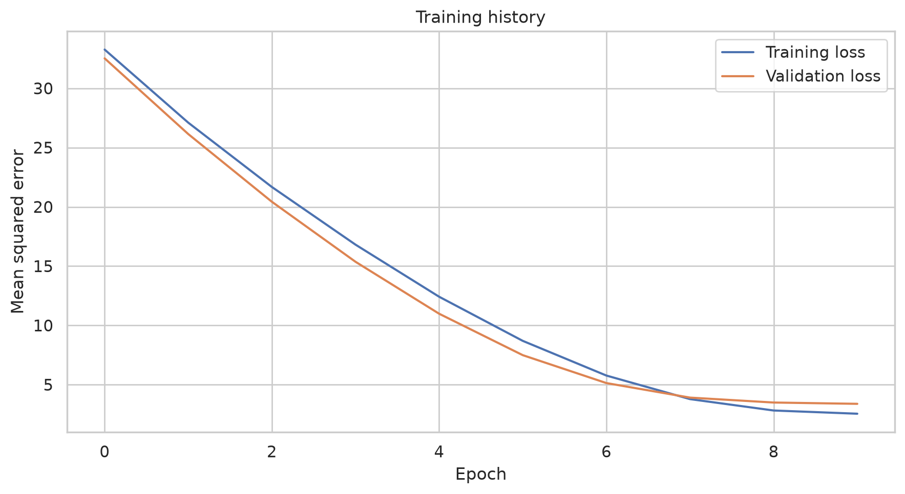
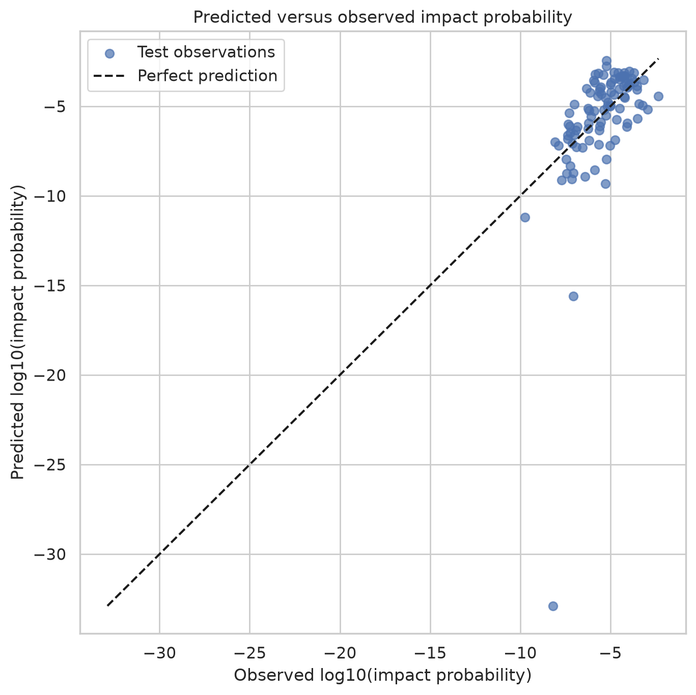
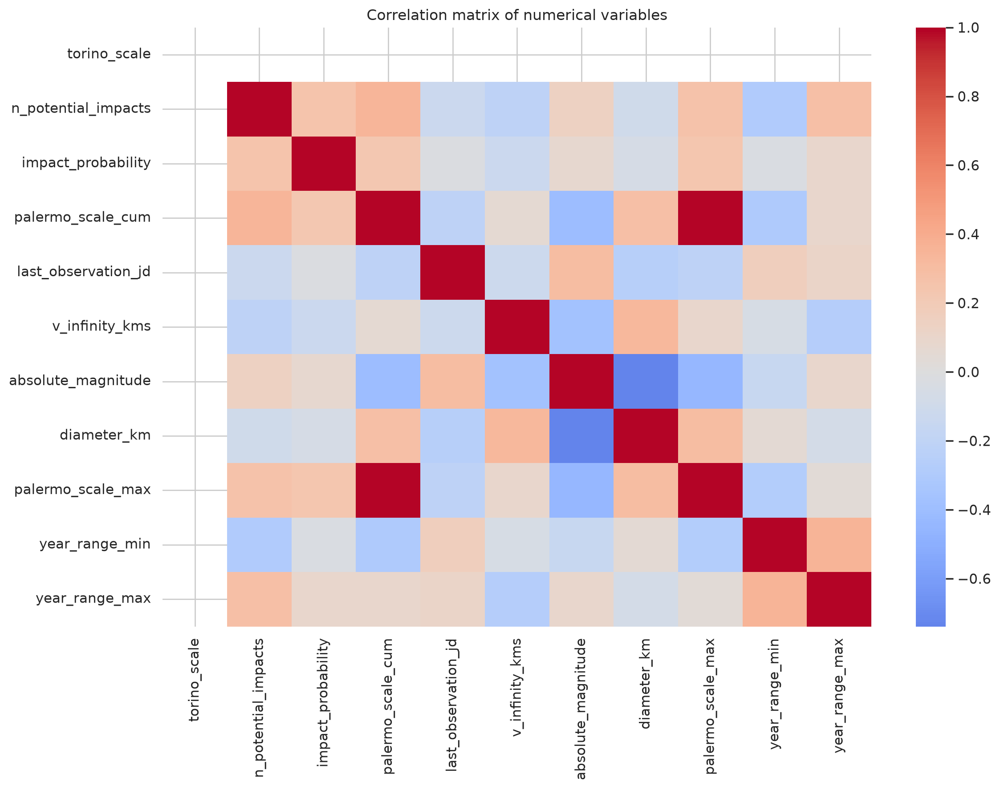
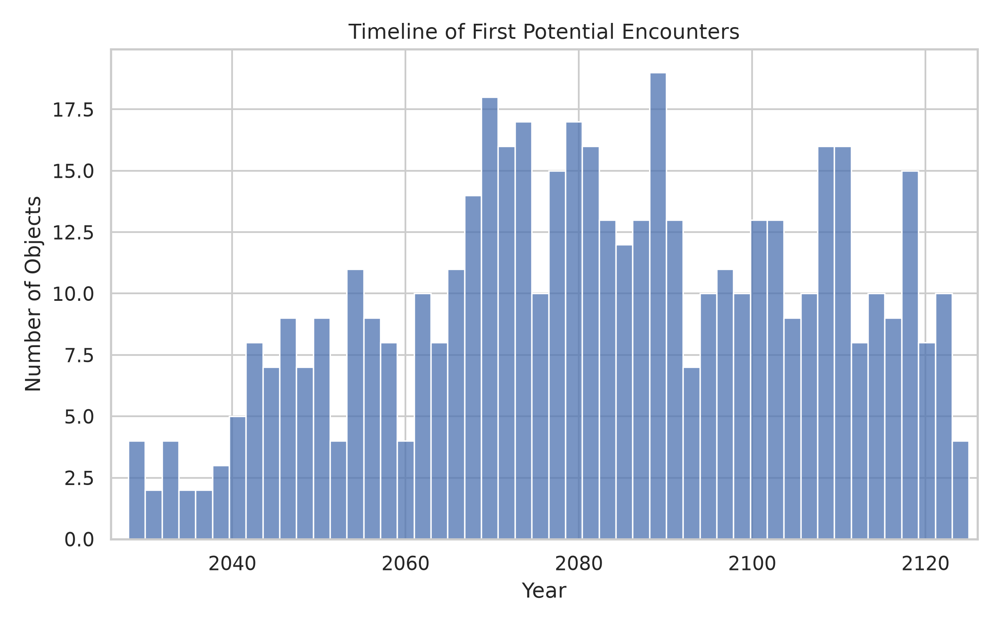
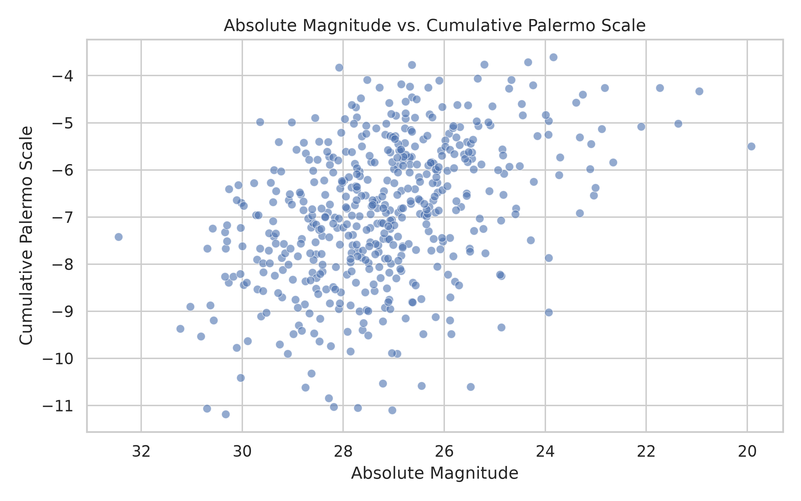
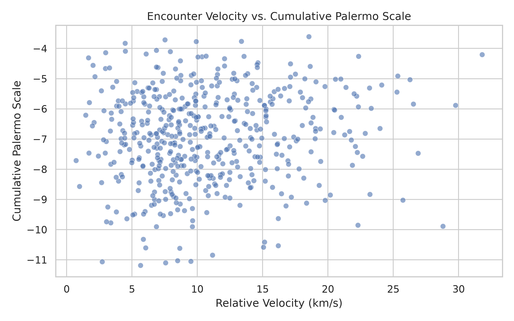

Results
=======

Model metrics
-------------

The model is evaluated using the following metrics:

* Mean Absolute Error.
* Root Mean Squared Error.
* R² score.

The metrics are stored in:

.. code-block:: text

   reports/model_metrics.csv

Training history
----------------

The training history is stored in:

.. code-block:: text

   reports/training_history.csv

This file contains information about the training and validation loss during
the training process.

Generated visualizations
------------------------

The project generates several visualizations in
``reports/figures/``.

Impact probability distribution
~~~~~~~~~~~~~~~~~~~~~~~~~~~~~~~

Training history
~~~~~~~~~~~~~~~~

Predictions versus observations
~~~~~~~~~~~~~~~~~~~~~~~~~~~~~~~

Correlation heatmap
~~~~~~~~~~~~~~~~~~~

Potential impact timeline
~~~~~~~~~~~~~~~~~~~~~~~~~

Magnitude versus Palermo scale
~~~~~~~~~~~~~~~~~~~~~~~~~~~~~~

Velocity versus Palermo scale
~~~~~~~~~~~~~~~~~~~~~~~~~~~~~

